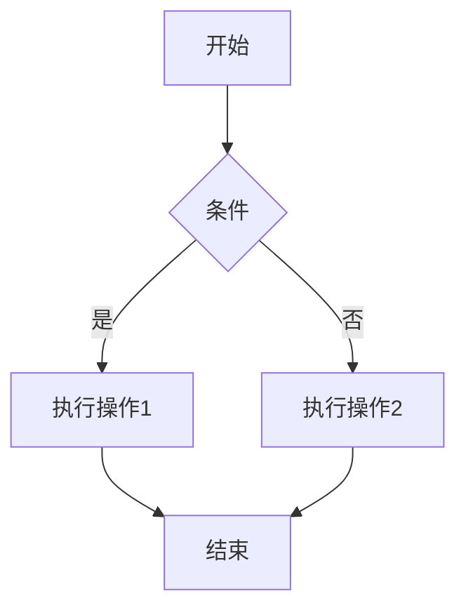
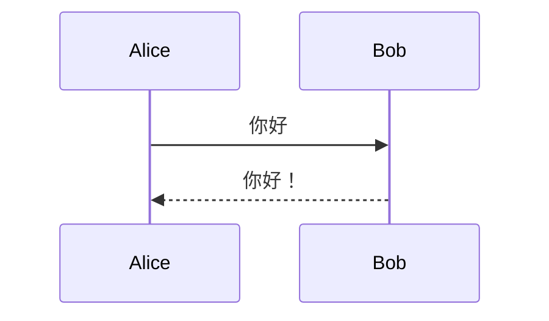

# 笔记 12

第十二个笔记。

## 流程图

```mermaid
graph TD
    A[开始] --> B{条件}
    B -->|是| C[执行操作1]
    B -->|否| D[执行操作2]
    C --> E[结束]
    D --> E
```

## 序列图

```mermaid
sequenceDiagram
    Alice->>Bob: 你好
    Bob-->>Alice: 你好！
```