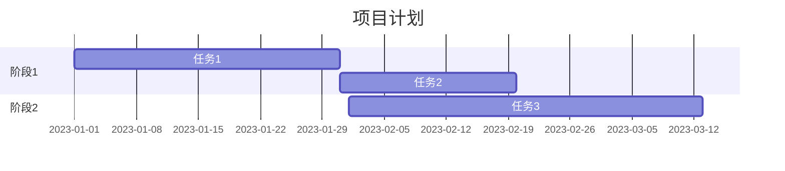
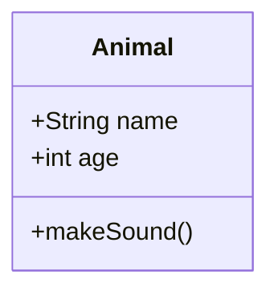

# 笔记 13

第十三个笔记。

## 甘特图

```mermaid
gantt
    title 项目计划
    dateFormat  YYYY-MM-DD
    section 阶段1
    任务1           :a1, 2023-01-01, 30d
    任务2           :a2, after a1, 20d
    section 阶段2
    任务3           :a3, 2023-02-01, 40d
```

## 类图

```mermaid
classDiagram
    class Animal {
        +String name
        +int age
        +makeSound()
    }
```