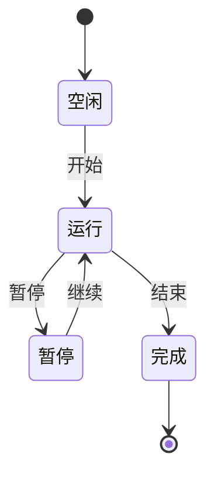
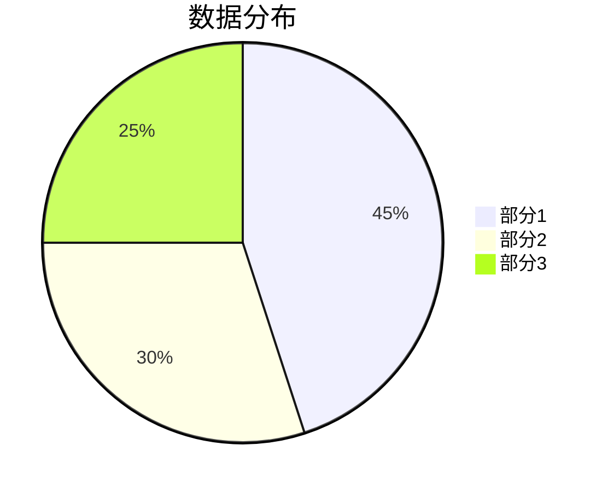

# 笔记 14

第十四个笔记。

## 状态图

```mermaid
stateDiagram
    [*] --> 空闲
    空闲 --> 运行: 开始
    运行 --> 暂停: 暂停
    暂停 --> 运行: 继续
    运行 --> 完成: 结束
    完成 --> [*]
```

## 饼图

```mermaid
pie title 数据分布
    "部分1" : 45
    "部分2" : 30
    "部分3" : 25
```

## 总结

这是第十四个笔记的总结内容。